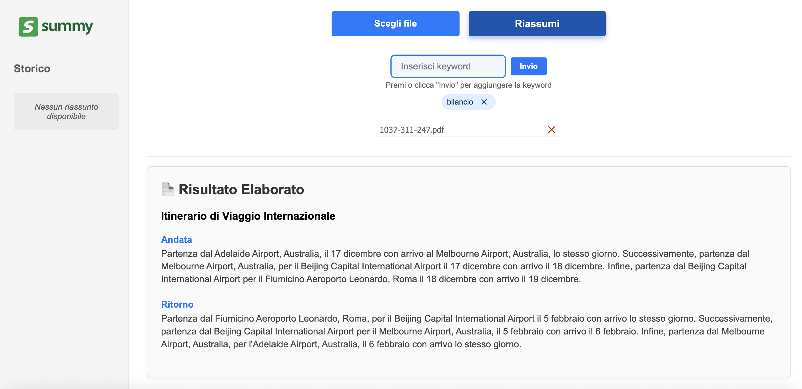

# Documentazione Utente – Summy: La piattaforma per trasferire conoscenza

## Che cos’è Summy?

Summy è uno strumento semplice e potente pensato per aiutarti a gestire e comprendere facilmente grandi quantità di documenti, file e dati aziendali, anche molto diversi tra loro. Puoi caricare documenti, immagini, audio, video e molto altro: Summy si occupa di riassumere e organizzare tutto in modo chiaro.

----

## Come funziona?

### 1. Carica i tuoi file

Puoi aggiungere uno o più file alla volta, anche di tipi diversi (ad esempio documenti, immagini, registrazioni audio o video). Puoi continuare ad aggiungere file senza perdere quelli caricati in precedenza.

### 2. Aggiungi parole chiave

Prima o dopo aver scelto i file, puoi inserire delle parole chiave, cioè i temi o argomenti su cui vuoi che Summy si concentri. Puoi scriverle una alla volta e aggiungerle premendo “Invio” o cliccando sul pulsante apposito.
Se digiti per sbaglio una parola più volte, Summy la manterrà una sola volta.

### 3. Invia per l’elaborazione

Quando hai finito di caricare file e inserire parole chiave, premi il pulsante per avviare l’elaborazione. Summy prenderà qualche momento per analizzare e sintetizzare tutto il materiale.

---

## Cosa ricevi in risposta?

Al termine, il risultato apparirà direttamente nella pagina:

* **Titolo generale**: un riassunto sintetico che indica l’argomento principale.
* **Divisione in capitoli**: i contenuti saranno suddivisi in sezioni chiare e organizzate per facilitare la lettura e la comprensione.
* Il risultato sarà strutturato in modo da farti risparmiare tempo e comprendere subito i punti chiave, anche se i dati originali sono molto complessi.

---

## Vantaggi per te e la tua azienda

* **Gestione facile e veloce** di qualsiasi tipo di documento o file.
* Sintesi chiara e immediata, senza dover leggere tutto manualmente.
* Possibilità di concentrarti sui temi più importanti grazie alle parole chiave.
* Risparmio di tempo prezioso nelle analisi e nella preparazione di report.
* Pronto per grandi moli di dati e file eterogenei, tipici delle realtà aziendali complesse come la tua.

---

## Cosa aspettarti in futuro

Presto sarà disponibile una funzione di accesso con login, che ti permetterà di:

* Tenere traccia delle tue richieste passate.
* Visualizzare facilmente gli elaborati precedenti.
* Accelerare i processi grazie a meccanismi di caching dei risultati.

---
